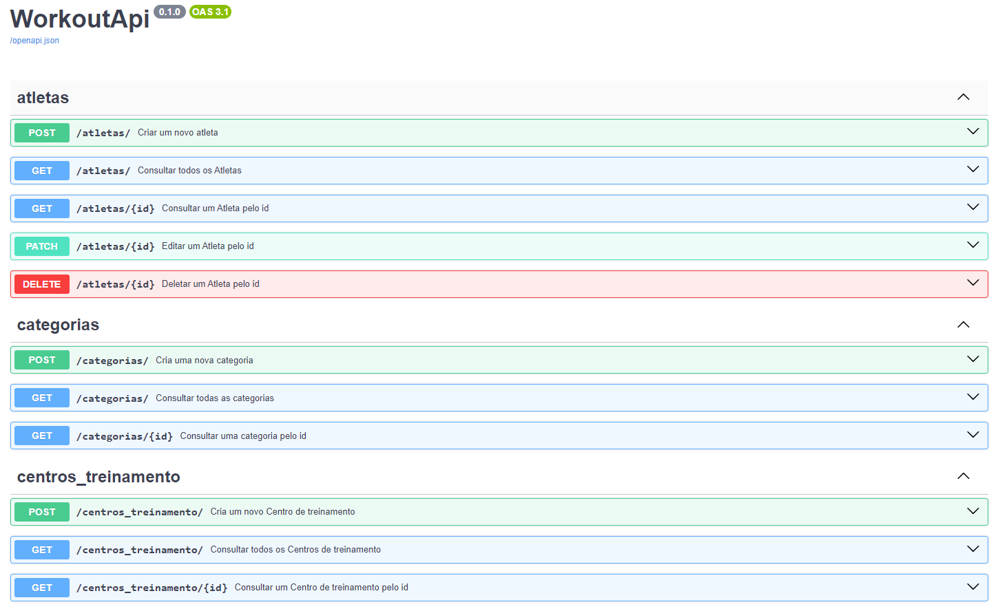

<h1 align="center" style="font-weight: bold;">Workout Api Rest 💻</h1>

<div align="center">

![python][PYTHON__BADGE]


</div>

<p align="center">
 <a href="#started">Como começar</a> •
 <a href="#routes">API Endpoints</a> •
 <a href="#author">Autor</a> •
</p>

<p align="center">
  <b>Construindo uma Api rest async com python usando o framework FastAPI no bootcamp Python AI Backend Developer </b>
</p>

<h2 id="started">🚀 Como começar</h2>

Para começar, siga as etapas abaixo

<h3> Tech Stack </h3>

- python
- fastAPI
- uvicorn
- sqlalchemy
- pydantic
- alembic
- postgresql
- docker

<h3>Clonar</h3>

Como clonar este projeto

```bash
git clone https://github.com/duca-meneses/workout_api.git
```

Depois de clonar o projeto

```bash
poetry install
```

se você não usa poetry

crie um ambiente virtual

```bash
python -m venv .venv
```

Ative seu ambiente virtual (.venv) no Windows

```bash
.venv/Scripts/activate
```

Ative seu ambiente virtual (.venv) no Linux/mac

```bash
source .venv/bin/activate
```

Agora, execute o comando para instalar as dependências do projeto

```bash
pip install -r requirements.txt
```

<h3>Starting</h3>

Para iniciar o servidor uvicorn para roda a aplicação FastAPI.
Faça o comando abaixo se vc esta usando o poetry

```bash
task run
```

para que esta usando o ambiente virtual(.venv)
faça o comando abaixo

```bash
uvicorn workout_api.main:app --reload
```


<h2 id="routes">📍 API Endpoints</h2>

Aqui esta a lista das principais rotas da API e quais são os corpos de solicitação esperados.



para acessar o Swagger da aplicação

http://localhost:8000/docs

<h2 id="author">Autor</h2>

<table
  >
  <tr>
    <td align="center">
      <a href="#">
        <br>
        <sub>
          <b>Carlos Eduardo</b>
        </sub>
      </a>
    </td>
  </tr>
</table>

<h2>Referencias</h2>

O repositório do projeto da dio: https://github.com/digitalinnovationone/workout_api

FastAPI: https://fastapi.tiangolo.com/

Pydantic: https://docs.pydantic.dev/latest/

SQLAlchemy: https://docs.sqlalchemy.org/en/20/

Alembic: https://alembic.sqlalchemy.org/en/latest/

Fastapi-pagination: https://uriyyo-fastapi-pagination.netlify.app/

[PYTHON__BADGE]: https://img.shields.io/badge/python-3670A0?style=for-the-badge&logo=python&logoColor=ffdd54

